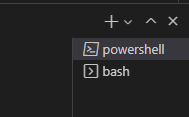
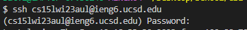
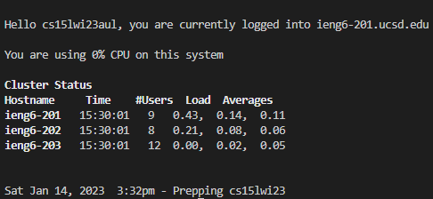
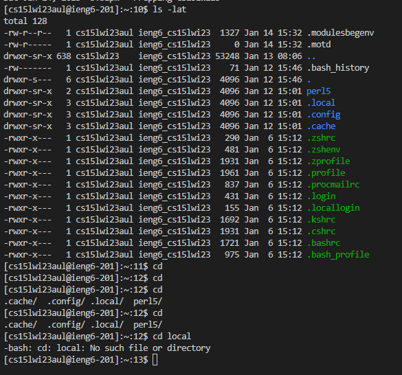

# **Lab 1**

Hello incoming CSE 15L students and welcome to the all-in-one tutorial on how to set up access to a remote server using VSCode. 
Here are the steps:
  1. Set up your CSE 15L accout.\
      a. Go to [https://sdacs.ucsd.edu/~icc/index.php](https://sdacs.ucsd.edu/~icc/index.php) \
      b. Login with your UCSD username and PID\
      c. Switch the account from your username to your CSE 15L account (should be formatted similarly to cs15lwi23xx)\
      d. Set your password (you should use your UCSD password for your current password)
  2. Download VSCode\
      a. Go to [VSCode](https://code.visualstudio.com/download) \
      
      b. Download the version for your operating system\
      c. Apply all default settings during the installation process
  3. Download [Git Bash](https://gitforwindows.org/) for Windows into VSCode.
      - Follow all default settings during the installation process
      - If you prefer, you can set bash as your default terminal when prompted
  4. Open VSCode and open a new terminal\
      a. Make sure it is the Bash terminal that you just downloaded\
      b. To check, look at the top right of the terminal and check the name.\
       \
      c. If it does not say bash, then click the downward arrow beside the plus and select bash.
  5. In the terminal, type the commond "ssh (your cs15lwi23xx username)@ieng6.ucsd.edu".
      - You should be prompted a message if you have never logged into the remote server. 
      - Type "yes" and press enter. 
  6. Type your password that you set for this account from step 1 when prompted.
      - Note that your password will not show for security reasons. \
      
      - Once you enter, the terminal should look like the image below\
      
  7. Once you are logged into the server, type some commands in to test it out.
       
      - These commands will be able to take you through the file system within the remote server
      - Explore these commonds to see what you are able to access

Congradulations! You have now connected your devcie to a remote server.
