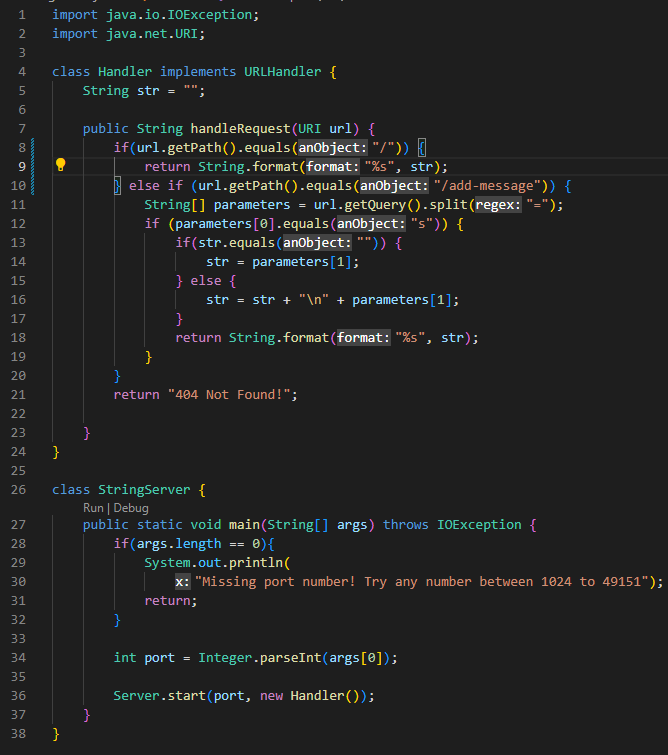

# **Lab 2**

## Part 1
Code for StringServer.java \


Screenshot #1 \
 \
This screenshot shows the add message command being used for the first time on the server. When the URI is inputted into the search bar, it is taken in and set to the URI variable url by calling handleRequest. The first if-statement parses the path of the URI to make sure it reads "/add-message" or else that is a 404 error. After making sure the path is correct, the query is retrieved and split by "=". This strings parsed from this command are stored in the parameters string array. The following if-statments makes sure the first parameter is "s" which allows the next parameter to be added to String str. String str was initialized with "" so the if statement checks to see if str is empty. Since it is, it adds "first input" to the empty str and returns str. 

Screenshot #2 \
 \
This screenshot shows a second message being added to the server. URI url is once again set to the inputted URI by calling handleRequest. The same steps as the previous input are executed until the if-statement to check of str is empty. String str contains "first input" from the previous "/add-message", so it is not empty and parameter[1] now contains the new input rather than the previous. This envokes the else section of the if-statement which adds a new line to everything that is contained in str and adds the given parameter into that new line. 


## Part 2
I have chosen to look at ArrayExamples.java. \
  - **Failure inducing input**
```
    @Test
    public void testReverseInPlace1() {
      int[] input = { 4, 5, 6, 99, 10 };
      ArrayExamples.reverseInPlace(input);
      assertArrayEquals(new int[]{ 10,99,6,5,4 }, input);
    }
```
  - **Non-Failure inducing input**
```
    @Test
    public void testReverseInPlace2() {
      int[] input = { 3 };
      ArrayExamples.reverseInPlace(input);
      assertArrayEquals(new int[]{ 3 }, input);
    }
```
  - **Symptoms for both tests** \
 
    - The first tests produces an error and show that the element at index 3 was expected to be 5 but was 99. The second test does not produce any message and passes         the test \
  - **The bug** 
    - Before
```
    static void reverseInPlace(int[] arr) {
      for(int i = 0; i < arr.length; i += 1) {
        arr[i] = arr[arr.length - i - 1];
      }
    }
```
    - After

## Part 3
