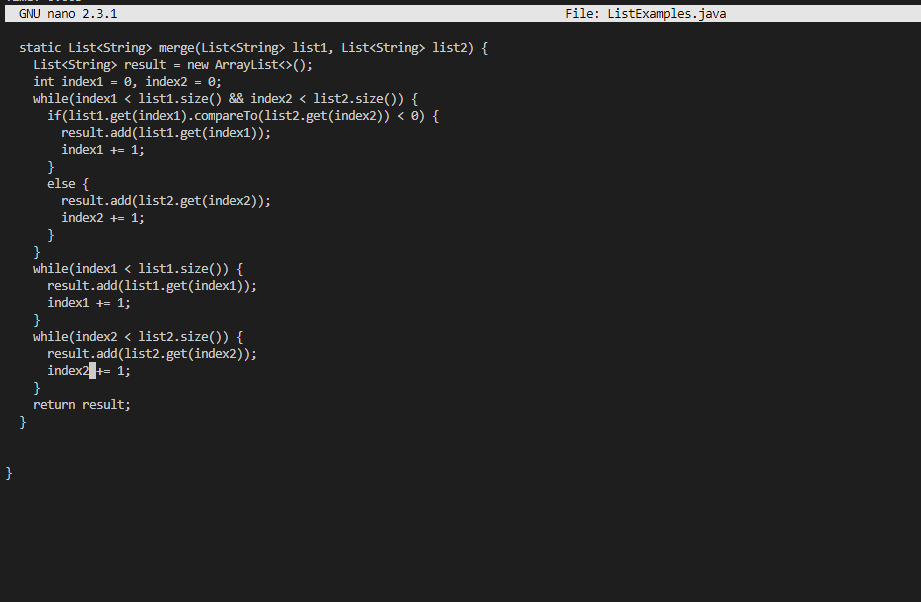

# **Lab 1**

## Step 4: Log into ieng6


**Keys Pressed:** ```<up><enter>``` \
The ssh cs15lwi23aul@ieng6.ucsd.edu was a previous command that I had entered on this terminal, so all I had to do was to use the up arrow to go to that previous call of that command and press enter to use it. And now that I have removed the need to type my password, I am automatically logged into this account. 
  
## Step 5: Clone your fork of the repository from your Github account


**Keys Pressed:** ```git clone <ctrl-V><enter>``` \
I copied the SSH key from the my repository from the Github website to my clipboard. I then went to my terminal, typed "git clone" and then pressed ctrl-V to paste the SSH key of the forked repository and pressed enter to complete the cloning process. 

## Step 6: Run the tests, demonstrating that they fail


**Keys Pressed:** ```cd l<tab><enter><ctrl-R> javac <enter><ctrl-R> javac <down><down><enter>``` \
I first had to cd into the newly created folder for the cloned repository. To do this, I typed "cd l" and then pressed tab and enter to auto complete the directory name and enter the directory. Next, I used ctrl-R and typed "javac" to find the compile command to compile all of the files in the directory and pressed enter to actually compile them. Finally, I used ctrl-R again and typed "javac" to find that same command, and then pressed the down arrow twice so that I could reach the java run command that normally follows it. I had to press down twice because I had typed an additional command at that time. After pressing enter, I recieve the message that one of the tests have failed. 

## Step 7: Edit the code file to fix the failing test




**Keys Pressed:** ```nano L<tab> .j <tab><enter> (hold)<down> (hold)<right><backspace> 2 <ctrl-O><enter><ctrl-X>``` \
I first typed "nano L" so that pressing tab would auto-correct me to the correct file. Since it was still missing ".java", I typed ".j" and pressed tab to auto-complete the final part. I then pressed enter to start editing the file through nano. I held down, then right to get to the error in the code where "index1" was supposed to be "index2". I changed the 1 to a 2 and then pressed ctrl-O to save the file to the same name and ctrl-X to exit nano. 

## Step 8: Run the tests, demonstrating that they now succeed


**Keys Pressed:** ```<up><up><up><enter><up><up><up><enter>```
All I had to do was compile and run the code again so I used the commands I had ran previously. I had to go up 3 times to reach the javac command, and after running that I had to go up 3 more times to reach the java command to run the tester.

## Step 9: Commit and push the resulting change to your Github account


**Keys Pressed:** ```git commit -a ListExamples bug fixed <esc> :qa git push```
I used the command "git commit -a" to commit all changes made to the directory. I then added the message "ListExamples bug fixed" to the commit and pressed escape and typed ":qa" to save the changes. Finally, I used the command git push to push all changes to the repository. 

